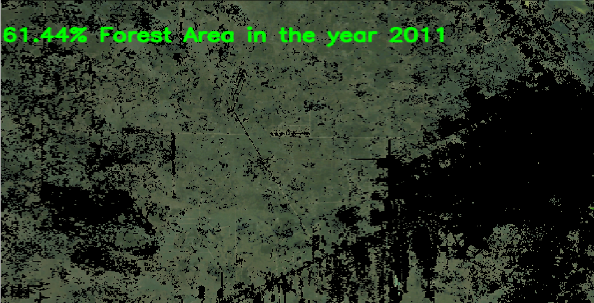

# ForestMonitor

**ForestMonitor** is a tool that detects and analyzes **deforested** areas in satellite images using **HSV color segmentation**. It calculates the **percentage** of green pixels and provides a visual output, which can help in assessing the extent of forest cover for environmental monitoring.

## Table of Contents

- [Installation](#installation)
- [Requirements](#requirements)
- [Features](#features)
- [Usage](#usage)

## Installation

To install **ForestMonitor**, follow the steps below:

1. Clone the repository:
   ```bash
   git clone https://github.com/yourusername/ForestMonitor.git
   cd ForestMonitor
   ```
2. Set up a virtual environment (recommended):
   ```bash
   python -m venv venv
   source venv/bin/activate  # On Windows, use venv\Scripts\activate
   ```
3. Install the required dependencies:
      ```bash
   pip install opencv-contrib-python numpy
   ```
## Requirements
* Python 3.7 or higher
* OpenCV (for image processing)
* NumPy (for numerical operations)

## Features
* **Green Area Detection**: Detects green areas (such as forests) in an image using HSV color segmentation.
* **Percentage Calculation**: Calculates the percentage of green pixels in the image and displays it.
* **Visual Output**: Displays the segmented image with the detected green regions highlighted.
* **Custom Text Overlay**: Shows the year (from the image filename) and the calculated percentage of forest cover directly on the image.

## Usage
1. **Prepare the Input Image**: The image should be in a format like `.jpg`, `.png`, or `.tif` and should contain satellite data of a forested region. Make sure the filename represents the year (e.g., `2025.png`).

2. **Run the Script**: To run the script and process an image, execute the following in your terminal:
```bash
python app.py
```
Ensure that the `image_path` variable in the script points to the location of the image you wish to analyze (e.g., `image_path = "Images/2011.png"`).

3. **Results**: The script will display a segmented image showing only the green areas (forest cover). It will also print out the percentage of forested area detected in the console. The result is based on the green pixel count using HSV color segmentation.

4. **Output**: The script will output an image with green areas highlighted, and the image will display text on the image with the following format:
   

5. **Adjust Parameters**: You can modify the `lower_HSV_values` and `upper_HSV_values` in the script to adjust the green color detection threshold based on the specific characteristics of the satellite image.
